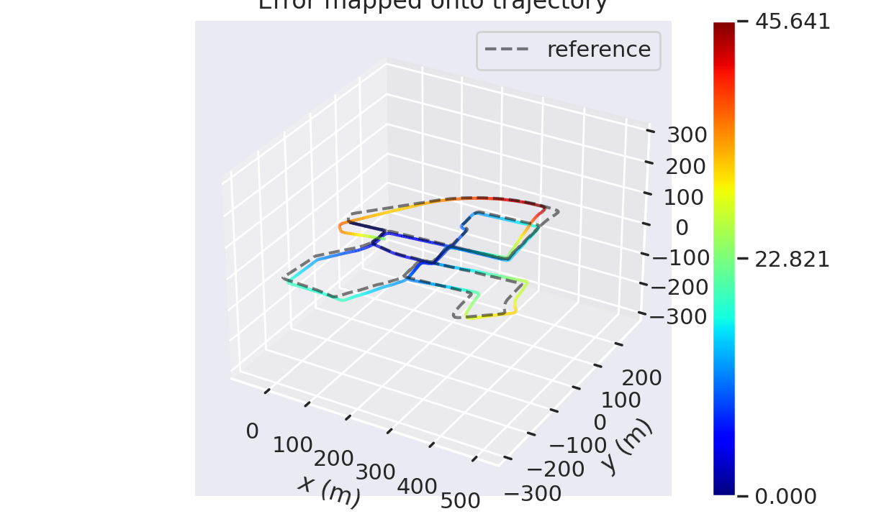
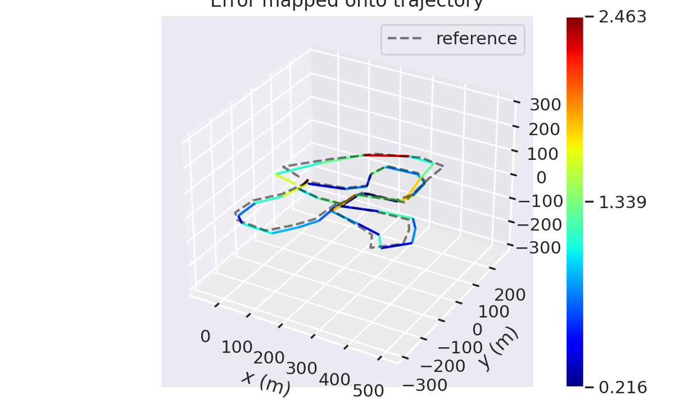

# aloam 解析式求解

编写的代码src/03-lidar-odometry-advanced/src/lidar_localization/include/lidar_localization/models/loam/aloam_factor.hpp中

主要实现了LidarEdgeAnalyticCostFunction 与 LidarPlaneAnalyticCostFunction 两个类 和 skew函数。

1. APE

2. RPE

